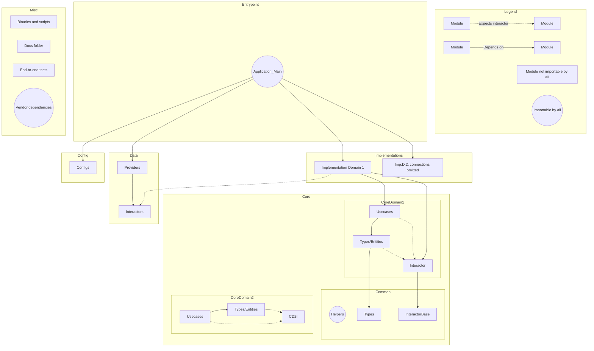
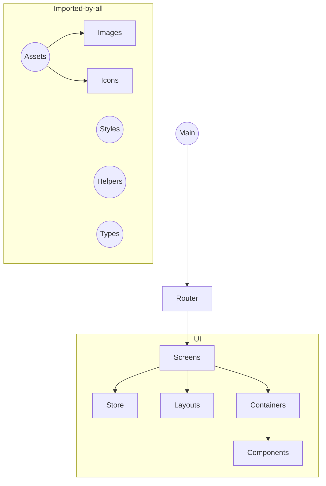
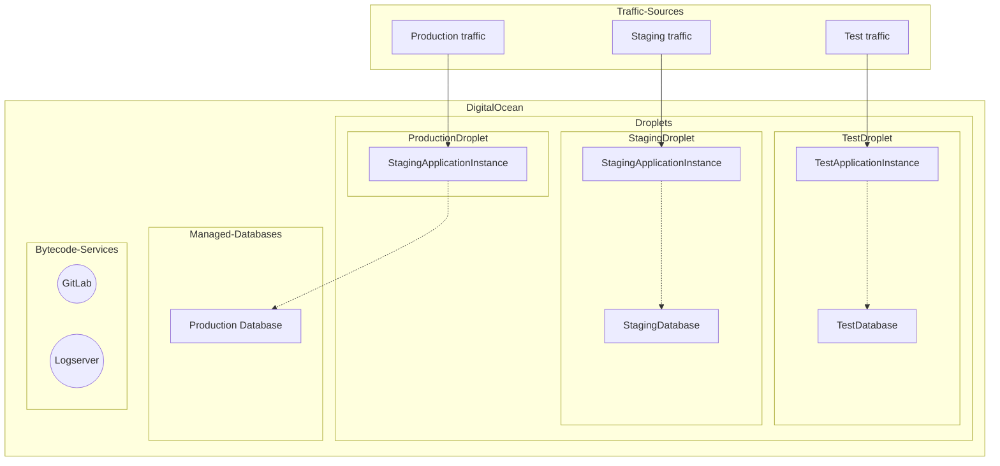

*All Mermaid graphs can also be rendered using [Mermaid Live Editor](https://mermaidjs.github.io/mermaid-live-editor/)*

## A: Source code architecture

### Repository design (main)

##### Notes:

* Only the first domain in Implementation and Core are connected to keep things organized
* Core domains can only depend on Core/Common, not on other Core domains
* Core domains cannot depend on vendor dependencies

### Repository design (mobile)

##### Notes:
* A Styled-Components theme will be passed through a theme-provider
* The assets directory only contains assets that are used in multiple parts of the application, otherwise assets should be grouped in the same folder where they'll be implemented

### Application source code structure

##### Core Domains

* Common
* Users (will also include organisations)
* DataEntries

##### Implementation Domains

* API
* CLI

##### Data Domains

* Database

## B: Cloud infrastructure

